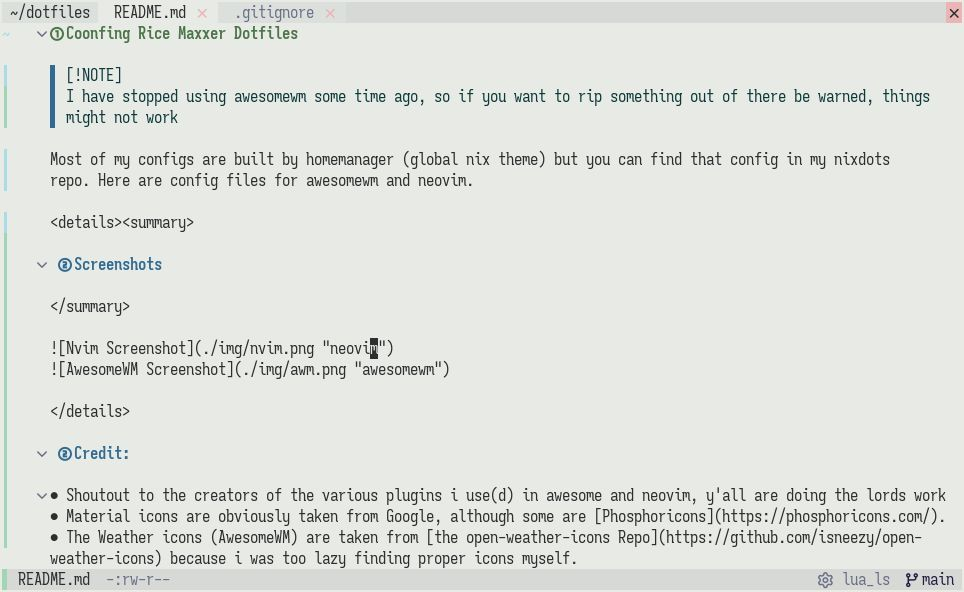
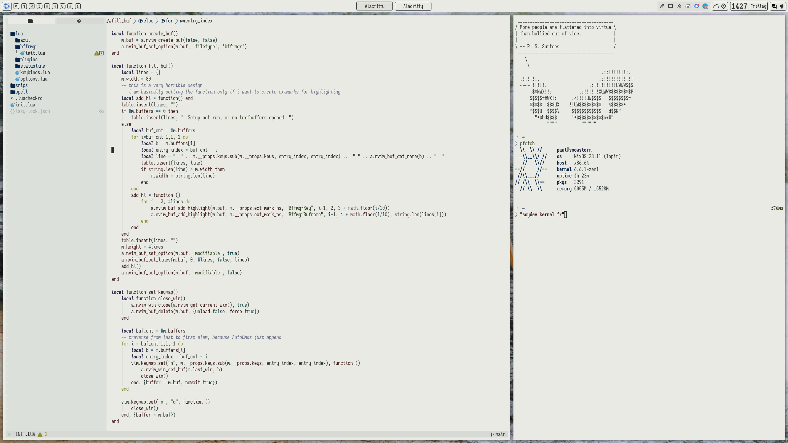

# Coonfing Rice Maxxer Dotfiles

> [!NOTE]
> I have stopped using awesomewm some time ago, so if you want to rip something out of there be warned, things
> might not work

Most of my configs are built by homemanager (global nix theme) but you can find that config in my nixdots
repo. In this repo are config files for awesomewm and neovim.

## Screenshots

## Credit:

- Shoutout to the creators of the various plugins i use(d) in awesome and neovim, y'all are doing the lords work
- Material icons are obviously taken from Google, although some are [Phosphoricons](https://phosphoricons.com/).
- The Weather icons (AwesomeWM) are taken from [the open-weather-icons Repo](https://github.com/isneezy/open-weather-icons) because i was too lazy finding proper icons myself.
