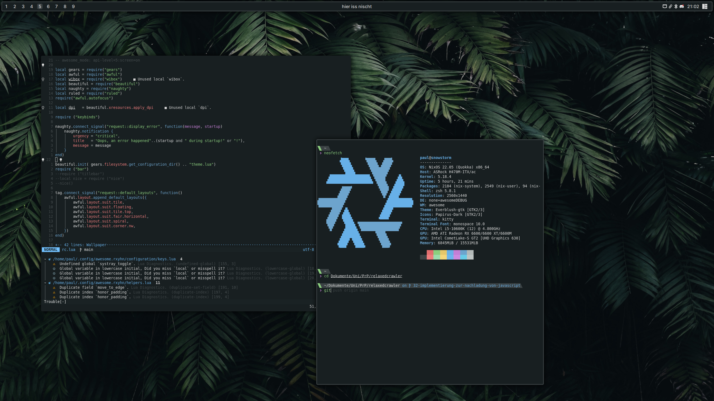

## My Desktop config files
Most of my configs are built by homemanager (you wont find me creating colorschemes in here...) but you can find that config in my nixdots repo

Credit:
Material icons are obviously taken from Google, although some are [Phosphoricons](https://phosphoricons.com/).

The Weather icons are taken from [the open-weather-icons Repo](https://github.com/isneezy/open-weather-icons) because i was too lazy finding proper icons myself.
